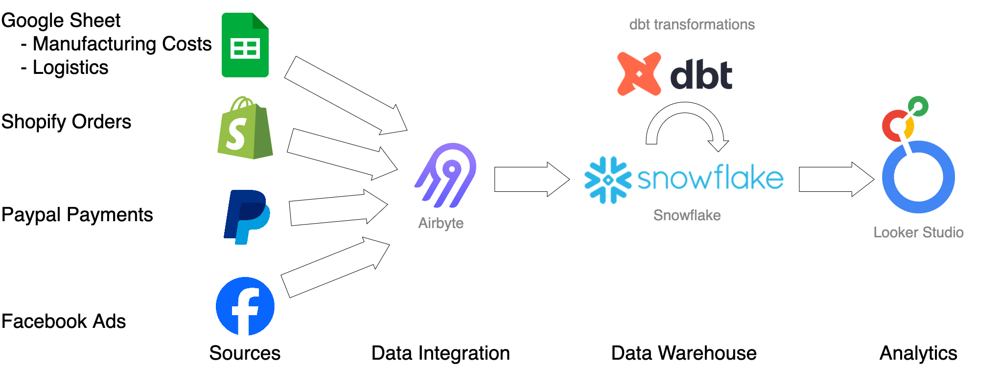
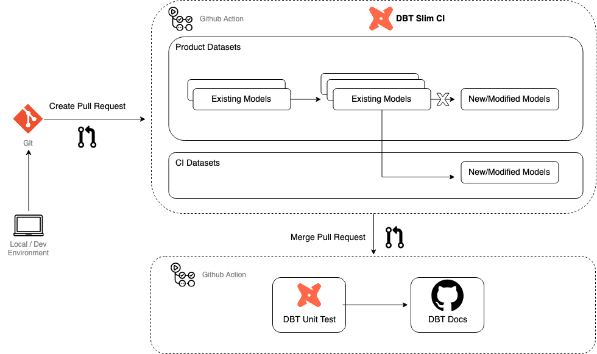
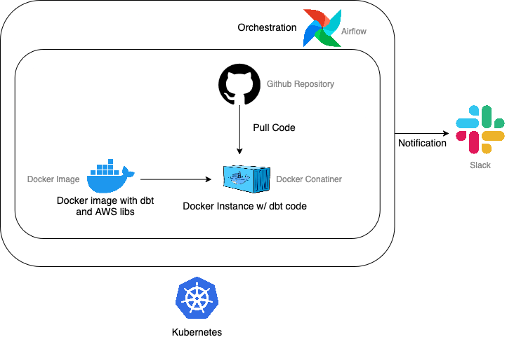
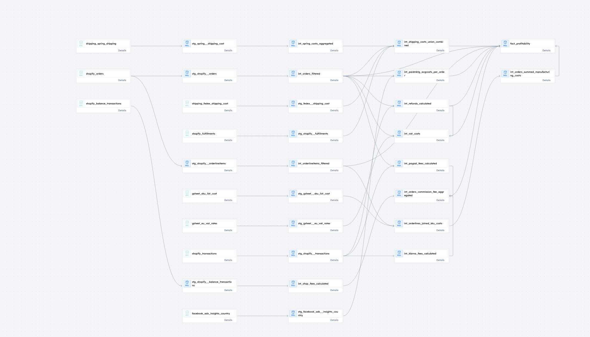
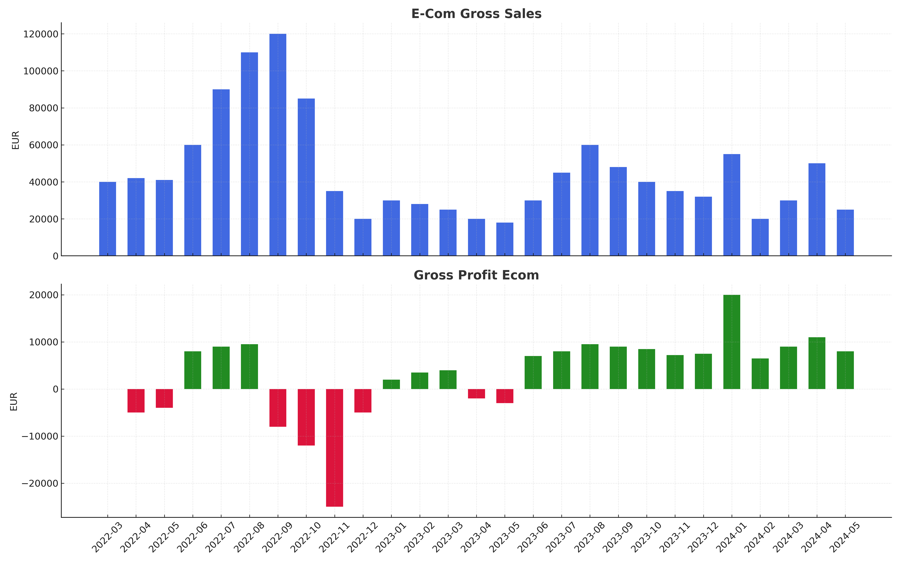

# Mainkode Analytics  

This project provides a modular, reusable, and open-source **dbt pipeline** to calculate e-commerce profitability. By integrating data from key sources like **Shopify**, **Facebook Ads**, **FedEx**, **GLS**, and more, the pipeline delivers actionable insights to optimize operations and marketing strategies.  

## Key Dashboards  
1. **Revenue & Profit Overview**: Order-level profitability.  
2. **Cost Factor Analysis**: Cost impacts as a % of revenue.  
3. **Profit Margins by Country**: Top-performing regions.  
4. **Marketing ROI**: Profit-driven ad spend optimization.  

## Architecture  

- **Data Sources**:  
  - Shopify: Orders, transactions, balances.  
  - Facebook Ads: Marketing performance.  
  - PayPal: Payment processing.  
  - FedEx/GLS: Shipping data (via GSheets).  
  - Manufacturing Costs: Cost data (via GSheets).  
- **Models**:  
  - **Staging**: Source data cleaning.  
  - **Intermediate**: Revenue and cost modeling.  
  - **Marts**: Profitability metrics and KPIs (`fact_orders`).  

## Workflow  

  

### Production  

  

## Data Lineage  

  

## Visualization

---  

**Author**: [Phong Nguyen](https://github.com/shrestic) (a.k.a. shrestic)  
